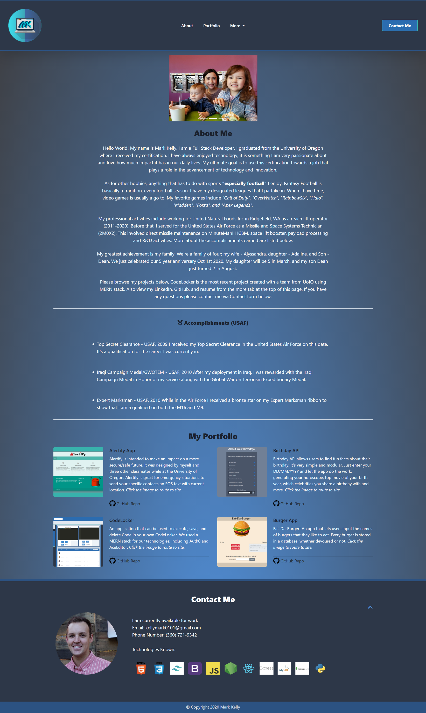

# My Portfolio

### About Me
I am a Full Stack Developer; Certified by the University of Oregon. This is my website with an About Me, Portfolio, and Contact section. It's React based with CSS integration. Using CSS from TailWind, I was able to make the website very functional, consistent, and aesthetically appealing. 
The navbar includes the following pages:

* About Me (view for my bio)

* Portfolio (view for my work)

* Contact Me (via form mail)

* More (Resume, GitHub, LinkedIn)

## Known Technologies

<code>

</code>

---

**Deployable Link** - https://markkelly.dev